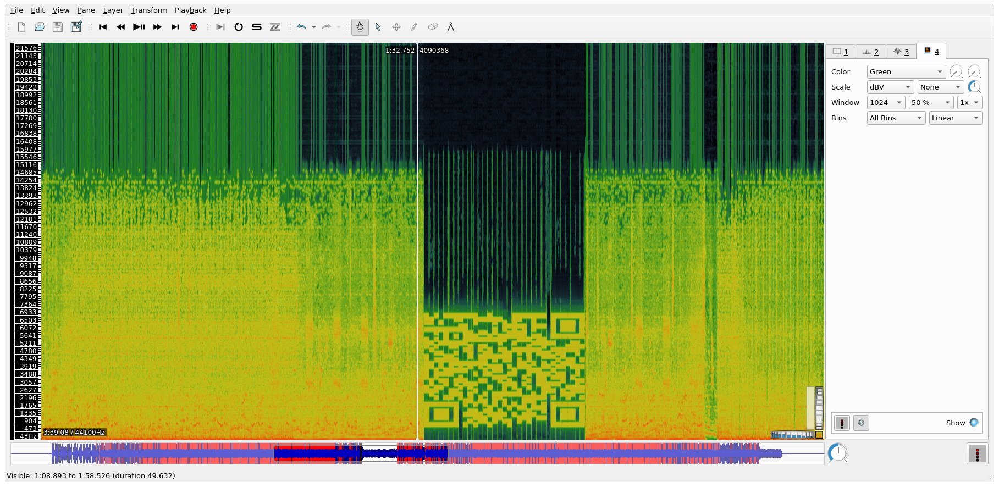

# Bad Apple | Misc 200

`Someone stumbled upon this file in a secure server. What could it mean?`

# Investigation
This one contained an MP4 file of some Anime dancing. I unfortunately watched the whole thing and didn't spot anything obvious. No flickering or weird artifacts that might suggest something encoded in the video stream.

I opened the file in Audacity and removed the video stream, since MP4's are not supported by [Sonic Visualizer](https://www.sonicvisualiser.org/), and hiding things in the spectrogram is a common CTF tactic.

Opening the file in Sonic Visualizer, if we scroll to the right we reveal a QR Code. Spooky

# Solving
I screencapped that, pulled it into [Gimp](https://www.gimp.org/), flipped it and cleaned up some of the lines. I also made it black on white, since my phone had trouble reading it.

Scanning, the flag is: `dctf{sp3ctr0gr4msAreCo0l}`
