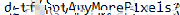

# Behind the scenes | Misc 400

```
Looks like a behind-the-scenes screenshot of the process behind this challenge was leaked. Can you use it to your advantage? (flag does not contain numbers)
```

# Investigation
The only attached file was a screenshot of a mac running `bootcamp`, to emulate Windows. In the back, was a blurred password. Likely this is what we need to find out.


[Cieran](https://github.com/cieran) found this very cool tool [Depix](https://github.com/beurtschipper/Depix), that is able to reverse the pixelization from certain tools like Gimp.

# Experiments
We cropped the image and tried every possible parameter combination to the tool, with very little luck. Just scrambled nonsense


On the discord, we found out there was an issue:

```
Red_Epicness: @everyone After investigating with one of the teams we have identified a potential issue in the intended solution for Behind the scenes challenge. If you feel like you should get the correct output but are not, DM me @Red_Epicness with the following:
- Tool used
- Command executed
- All input parameters for the command
- Output of the tool ,including the terminal output

We are working on replicating the issue locally, until then, do as above. There are many teams for which the intended solution works, which means I will not be providing hints to you, I will merely confirm whether you are experiencing the identified issue.

We are sorry for any issues caused by this and are working to resolve it.

```

We pinged the admins, were validated and got the flag through them!.

Perhaps this was an OS issue, a file encoding issue, maybe the way MacOS crops the image or something. Who knows!


`dctf{GotAnyMorePixels}`
