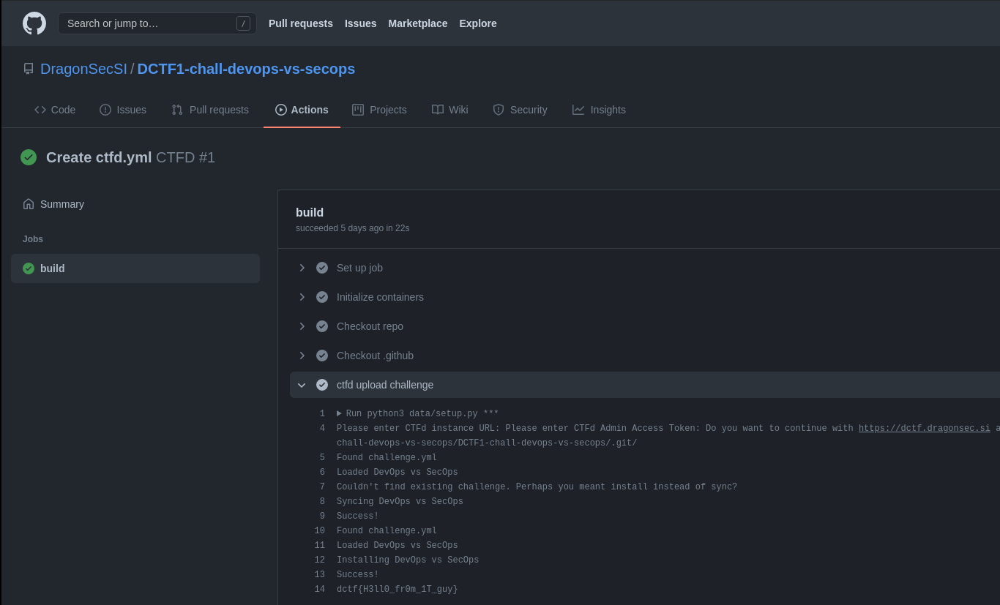

# DevOps vs SecOps | Misc 200

```
Automatization is amazing when it works, but it all comes at a cost... You have to be careful...

(URL not missing)
```

# Investigation
As part of a separate challenge, the organizers had "Leaked" a repo. Beside that repo, was another with the same name as this challenge. An obvious enough starting point.

The name suggests it might be related to CI/CD, which you can generally see under `Actions`


# The solve

Digging through the logs of each step, eventually you see the flag in plain text. 
!
