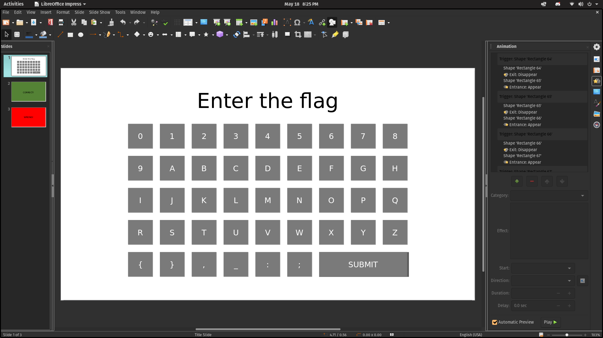
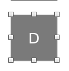

# Powerpoint programming | Misc 200

`A login page in powerpoint should be good enough, right?`

# Investigation
Good lord, what fresh hell is this.

First I checked for any macros or attached visal basic, but there was none. There is a clear Correct screen, but that also does nothing.

There appears to be nothing smart about this document at all, except about 100 animations.

I clicked the animations, and it didn't seem like even they did anything either. Pressing down arrow allows you to iterate through the buttons which highlight them on the key pad. Simple disappear effects that didn't seem to trigger.

As I went 1 by 1, nothing stood out until `64`, which was a `D`. 65 was a `C`,66 was a `T`,67 was a `F`

THEY SPELL OUT THE FLAG!  

# The Solve

I walked through the buttons one by one, and decoded the string:  `dctf{ppt_1snt_v3ry_s3cur3_1s_1t}`
